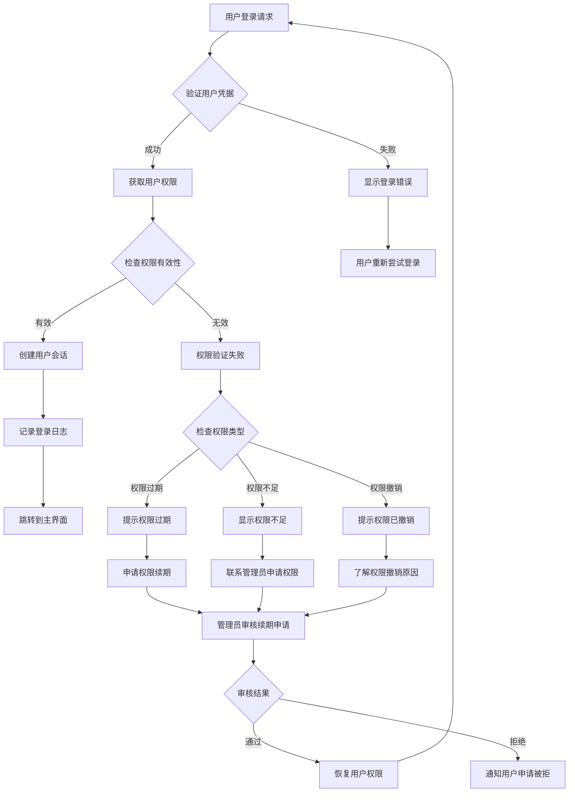
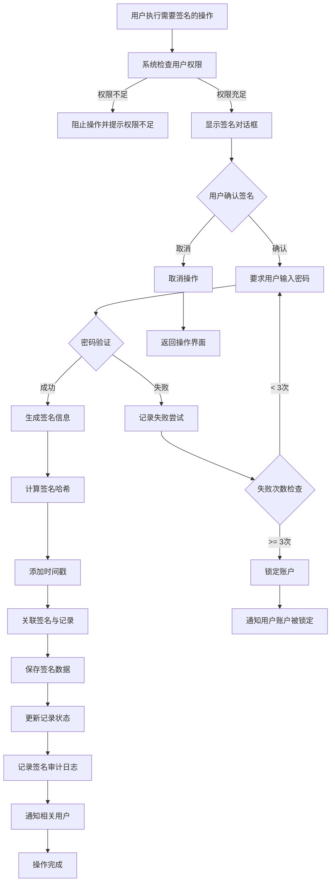
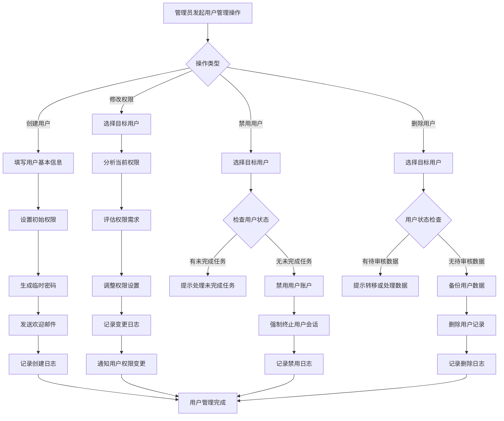
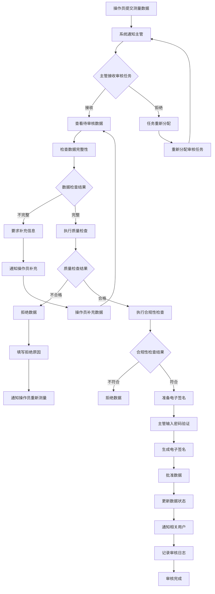

# 放射化学纯度检测仪 - 三级权限操作说明

## 目录

1. [权限系统概述](#1-权限系统概述)
2. [操作员（OPERATOR）指南](#2-操作员operator指南)
3. [主管（SUPERVISOR）指南](#3-主管supervisor指南)
4. [管理员（ADMIN）指南](#4-管理员admin指南)
5. [电子签名操作](#5-电子签名操作)
6. [权限管理操作](#6-权限管理操作)
7. [安全操作指南](#7-安全操作指南)
8. [故障排除](#8-故障排除)
9. [操作流程图](#9-操作流程图)
10. [API接口说明](#10-api接口说明)
11. [最佳实践](#11-最佳实践)

---

## 1. 权限系统概述

### 1.1 三级权限体系介绍

放射化学纯度检测仪采用三级权限体系，确保系统安全性和数据完整性：

- **OPERATOR（操作员）**：基础操作权限，负责日常测量和数据录入
- **SUPERVISOR（主管）**：中级管理权限，负责数据审核和批准流程
- **ADMIN（管理员）**：最高权限，负责系统配置和用户管理

### 1.2 权限级别和范围

| 权限级别 | 操作范围 | 数据访问 | 系统配置 | 用户管理 |
|---------|---------|---------|---------|---------|
| OPERATOR | 测量、数据录入 | 查看和创建 | 无 | 无 |
| SUPERVISOR | 审核、批准、修改 | 查看、修改、删除 | 部分 | 无 |
| ADMIN | 全部权限 | 全部 | 全部 | 全部 |

### 1.3 CFR 21 Part 11合规性说明

本系统严格按照美国FDA 21 CFR Part 11电子记录和电子签名规定设计：

- **数据完整性**：所有操作均有完整的审计追踪
- **电子签名**：符合法律效力的电子签名机制
- **访问控制**：基于角色的权限管理系统
- **数据安全**：加密存储和传输保护

---

## 2. 操作员（OPERATOR）指南

### 2.1 登录和身份验证

#### 登录流程
1. 打开放射化学纯度检测仪应用程序
2. 在登录界面输入用户名和密码
3. 点击"登录"按钮
4. 系统验证身份后进入主界面

#### 安全要求
- 首次登录必须修改默认密码
- 密码复杂度要求：至少8位，包含大小写字母、数字和特殊字符
- 建议每90天更换一次密码
- 连续3次登录失败将锁定账户

#### 密码设置
```
密码要求：
- 最少8个字符
- 至少包含1个大写字母
- 至少包含1个小写字母
- 至少包含1个数字
- 至少包含1个特殊字符(!@#$%^&*等)
```

### 2.2 数据查看和查询

#### 历史数据查看
- **菜单路径**：数据管理 → 历史数据查看
- **功能说明**：
  - 可查看自己创建的测量数据
  - 可查看已审核通过的测量数据
  - 支持按日期、样品编号、测量类型筛选
  - 支持数据导出（PDF、Excel格式）

#### 查询条件设置
```
查询参数：
- 日期范围：选择起始和结束日期
- 样品编号：输入精确或模糊匹配
- 测量类型：选择纯度、活度、能量等
- 审核状态：已审核、待审核、已拒绝
- 创建人：可查看其他操作员的数据（只读权限）
```

### 2.3 测量数据创建和录入

#### 新建测量任务
1. **选择测量模式**
   - 纯度测量
   - 活度测量
   - 能谱分析
   - 核素识别

2. **录入样品信息**
   ```
   必填字段：
   - 样品编号（系统自动生成或手动输入）
   - 样品名称
   - 测量日期和时间
   - 测量人员
   - 样品描述
   
   可选字段：
   - 生产批次
   - 供应商信息
   - 存储条件
   - 备注信息
   ```

3. **执行测量**
   - 点击"开始测量"按钮
   - 系统自动记录测量参数
   - 实时显示测量进度
   - 测量完成后自动保存数据

#### 数据录入规范
- 所有测量数据必须及时录入（不超过测量完成后2小时）
- 数据录入时必须包含完整的样品信息
- 测量参数不得随意修改
- 发现错误数据应立即报告主管

### 2.4 基本数据操作权限

#### 允许的操作
- ✅ 创建新的测量数据
- ✅ 查看历史测量数据
- ✅ 修改未提交的数据（仅限自己创建）
- ✅ 导出测量报告
- ✅ 查看设备状态和校准信息

#### 禁止的操作
- ❌ 删除任何测量数据
- ❌ 修改已提交的数据
- ❌ 访问其他用户创建的未审核数据
- ❌ 修改系统配置
- ❌ 查看审计日志
- ❌ 访问用户管理功能

### 2.5 操作员限制和边界

#### 数据访问边界
- 仅能访问自己创建的数据
- 可查看已审核通过的他人数据（只读）
- 无法访问未审核的他人数据
- 无法查看敏感系统信息

#### 操作时间限制
- 系统会话超时：30分钟无操作自动退出
- 单次登录最长时长：8小时
- 数据修改窗口期：创建后24小时内可修改
- 数据提交期限：测量完成后必须48小时内提交审核

---

## 3. 主管（SUPERVISOR）指南

### 3.1 拥有操作员所有权限

作为主管，您拥有操作员的所有基础权限，并额外具备以下管理功能：

#### 扩展的数据访问权限
- 查看所有操作员创建的测量数据
- 访问待审核、已拒绝的所有数据
- 查看完整的测量历史记录
- 访问审计日志（有限范围）

### 3.2 数据审核和批准流程

#### 审核流程概述
1. **接收审核任务**
   - 系统自动分配待审核数据
   - 可查看审核队列
   - 支持按优先级排序

2. **执行数据审核**
   ```
   审核检查项目：
   - 样品信息完整性
   - 测量参数合理性
   - 数据逻辑一致性
   - 符合性检查（与标准对比）
   - 操作规范遵循情况
   ```

3. **审核决策**
   - **批准**：数据合格，签字确认后生效
   - **拒绝**：数据不合格，要求重新测量或修改
   - **退回**：需要补充信息或澄清

#### 审核操作步骤
1. 选择待审核的测量任务
2. 仔细检查所有测量数据
3. 查看测量过程中的日志信息
4. 根据检查结果选择操作：
   - 点击"批准"按钮 → 进入电子签名流程
   - 点击"拒绝"按钮 → 填写拒绝原因
   - 点击"退回"按钮 → 指定需要补充的信息

### 3.3 数据修改和更新权限

#### 数据修改范围
- 可修改任何测量数据的基本信息
- 可调整测量参数（需记录修改原因）
- 可补充缺失的样品信息
- 可添加审核意见和备注

#### 修改操作规范
```
修改记录要求：
- 必须记录修改时间
- 必须记录修改人员
- 必须说明修改原因
- 修改前后对比信息
- 修改影响的范围说明
```

#### 特殊修改权限
- **批量修改**：可对多个相似数据进行批量更新
- **紧急修改**：在紧急情况下可立即修改（事后必须报告）
- **参数调整**：可修改测量设备的运行参数

### 3.4 审计日志查看和查询

#### 审计日志功能
- **菜单路径**：系统管理 → 审计日志查看
- **查询功能**：
  - 按时间范围查询
  - 按用户查询
  - 按操作类型查询
  - 按数据对象查询

#### 审计日志内容
```
日志记录包括：
- 用户身份信息
- 操作时间和日期
- 操作类型（创建、修改、删除、审核等）
- 操作对象（数据ID、样品编号等）
- 操作结果（成功、失败、警告）
- IP地址和设备信息
- 详细的操作描述
```

#### 日志导出功能
- 支持导出为Excel格式
- 可设置导出时间范围
- 支持按条件筛选导出
- 导出文件自动加密

### 3.5 报告审核和签署

#### 报告审核流程
1. **接收报告审核任务**
   - 系统通知新的报告待审核
   - 可查看报告摘要信息
   - 支持报告预览功能

2. **执行报告审核**
   - 检查报告数据完整性
   - 验证测量结果的合理性
   - 确认符合相关标准要求
   - 检查报告格式规范性

3. **电子签名确认**
   - 使用电子签名确认审核通过
   - 记录签名时间和审核意见
   - 报告状态更新为"已审核"

#### 报告类型
- **日常测量报告**：标准测量结果的汇总报告
- **质量控制报告**：QC检查和验证结果报告
- **异常事件报告**：测量过程中异常情况的报告
- **设备校准报告**：设备维护和校准结果的报告

### 3.6 权限提升和授权

#### 临时权限授予
- 可为操作员临时提升权限（最长24小时）
- 需记录授权原因和时间
- 权限自动过期，无需手动回收

#### 工作委托
- 可将审核工作委托给其他主管
- 支持设置委托期限
- 委托期间保留审计记录

#### 权限监督
- 监督操作员的日常工作
- 发现权限滥用立即报告管理员
- 定期审查权限使用情况

---

## 4. 管理员（ADMIN）指南

### 4.1 拥有所有系统权限

管理员拥有系统的最高权限，可以执行所有操作：

#### 完整数据访问权限
- 查看、修改、删除所有测量数据
- 访问所有用户的操作记录
- 查看完整的系统日志
- 访问系统配置信息

#### 系统管理权限
- 用户账号管理
- 系统参数配置
- 权限分配和调整
- 系统维护和备份

### 4.2 用户账号管理

#### 用户创建
```
创建用户流程：
1. 用户管理 → 新建用户
2. 填写用户基本信息：
   - 用户名（唯一标识）
   - 真实姓名
   - 邮箱地址
   - 联系电话
   - 所属部门
   - 职位信息
3. 设置初始权限级别
4. 生成临时密码
5. 通知用户首次登录
```

#### 用户信息修改
- 可修改用户的任何基本信息
- 可重置用户密码
- 可更新用户联系方式
- 可调整用户所属部门

#### 用户状态管理
- **启用/禁用用户**：控制用户登录权限
- **锁定/解锁用户**：处理安全违规情况
- **密码重置**：帮助用户恢复访问
- **会话管理**：强制用户退出登录

#### 用户删除
```
删除用户注意事项：
- 删除前必须备份用户数据
- 需确保无待审核的测量数据
- 必须记录删除原因
- 需通知相关管理人员
- 删除操作不可逆
```

### 4.3 系统配置和参数设置

#### 测量参数配置
- **设备参数设置**：
  - 测量时间参数
  - 能量范围设置
  - 探测器配置
  - 校准参数管理

- **质量控制参数**：
  - 合格标准设置
  - 警告阈值配置
  - 质量控制规则
  - 异常处理流程

#### 系统安全设置
- **密码策略配置**：
  - 密码复杂度要求
  - 密码过期时间
  - 密码历史记录
  - 账户锁定策略

- **会话管理设置**：
  - 登录超时时间
  - 会话保持策略
  - 并发登录限制
  - 安全退出设置

#### 审计配置
- **日志记录设置**：
  - 日志记录级别
  - 日志保存期限
  - 日志备份策略
  - 日志清理规则

- **电子签名配置**：
  - 签名验证方式
  - 签名过期时间
  - 签名审计规则
  - 签名备份设置

### 4.4 权限分配和管理

#### 权限级别管理
```
权限级别定义：
- LEVEL_1 (OPERATOR): 基础操作权限
- LEVEL_2 (SUPERVISOR): 中级管理权限  
- LEVEL_3 (ADMIN): 最高管理权限
```

#### 权限分配流程
1. **评估用户需求**：了解用户的职责和需要执行的操作
2. **选择合适权限**：根据最小权限原则分配
3. **设置权限有效期**：为临时权限设置过期时间
4. **通知用户**：告知用户新权限和注意事项
5. **记录分配日志**：详细记录权限分配过程

#### 权限审查
- **定期审查**：每季度审查用户权限合理性
- **权限回收**：用户职责变更时及时调整权限
- **权限审计**：定期检查权限使用情况
- **违规处理**：发现权限滥用立即采取措施

### 4.5 系统维护和备份

#### 数据备份策略
```
备份类型：
- 完整备份：每周执行一次
- 增量备份：每天执行一次
- 事务日志备份：每小时执行一次
- 配置备份：每次配置变更后立即备份
```

#### 备份操作流程
1. **选择备份类型**：完整备份或增量备份
2. **设置备份位置**：本地存储或远程存储
3. **配置备份参数**：压缩、加密等选项
4. **执行备份任务**：立即执行或定时执行
5. **验证备份完整性**：检查备份文件有效性

#### 系统恢复
- **灾难恢复计划**：制定完整的系统恢复流程
- **数据恢复操作**：从备份文件恢复数据
- **系统重建**：在严重故障时重建系统
- **恢复验证**：确保恢复后的系统正常运行

#### 性能监控
- **系统性能指标**：
  - CPU使用率
  - 内存使用情况
  - 磁盘空间占用
  - 网络连接状态

- **数据库性能**：
  - 查询响应时间
  - 连接池状态
  - 锁等待情况
  - 索引使用效率

### 4.6 高级设置和优化

#### 数据库优化
- **索引优化**：创建和维护适当的数据库索引
- **查询优化**：分析和优化慢查询
- **分区管理**：大数据表的分区策略
- **统计信息更新**：定期更新数据库统计信息

#### 系统性能调优
- **缓存配置**：
  - 应用层缓存设置
  - 数据库查询缓存
  - 文件缓存管理

- **并发处理优化**：
  - 线程池配置
  - 连接池管理
  - 负载均衡设置

#### 安全加固
- **网络安全配置**：
  - 防火墙规则设置
  - SSL/TLS证书管理
  - 网络访问控制

- **数据加密**：
  - 敏感数据加密存储
  - 传输过程加密保护
  - 密钥管理策略

---

## 5. 电子签名操作

### 5.1 电子签名要求和场景

#### CFR 21 Part 11电子签名要求
电子签名必须满足以下法律要求：
- **唯一性**：每个用户有唯一的电子签名
- **可验证性**：签名可以被验证和认证
- **不可抵赖性**：签名者不能否认其签名行为
- **关联性**：签名与被签名的记录直接关联
- **时间戳**：签名包含准确的时间信息

#### 需要电子签名的操作场景
```
强制签名操作：
- 测量数据的最终确认
- 质量控制报告的批准
- 异常事件的报告和确认
- 系统配置的修改
- 用户权限的分配和变更
- 数据删除和修改操作
- 系统维护操作
- 审计日志的审核确认
```

### 5.2 签名创建和验证流程

#### 电子签名创建流程
1. **触发签名请求**
   - 用户执行需要签名的操作
   - 系统显示签名对话框
   - 确认签名内容和要求

2. **身份验证**
   ```
   验证步骤：
   - 验证当前登录用户身份
   - 要求输入用户密码确认
   - 可选：使用双因素认证
   - 验证用户权限是否足够
   ```

3. **签名信息生成**
   ```
   签名信息包括：
   - 签名者用户ID和姓名
   - 签名时间（精确到毫秒）
   - 签名原因和操作描述
   - 被签名记录的标识
   - 签名哈希值（防篡改）
   ```

4. **签名存储和关联**
   - 将签名信息存储到签名数据库
   - 与对应的记录建立关联关系
   - 更新记录的签名状态
   - 生成审计日志记录

#### 签名验证流程
1. **签名完整性检查**
   - 验证签名数据是否完整
   - 检查签名哈希值是否有效
   - 确认签名时间戳的合理性

2. **签名者身份验证**
   - 验证签名者的用户ID
   - 检查签名者的权限状态
   - 确认签名时间是否在有效期内

3. **签名关联验证**
   - 验证签名与记录的正确关联
   - 检查签名内容与记录内容的一致性
   - 确认没有重复签名或伪造签名

### 5.3 关键操作的签名要求

#### 数据审核签名
```
审核签名要求：
- 必须由SUPERVISOR或ADMIN级别用户执行
- 签名时必须输入用户密码
- 签名内容必须包含审核意见
- 签名后数据状态变更为"已审核"
- 签名信息永久保存，不可删除
```

#### 数据修改签名
```
修改签名要求：
- 修改前后的差异必须清晰记录
- 签名必须说明修改原因
- 敏感数据修改需要双人签名确认
- 修改操作必须记录在审计日志中
- 签名后数据版本号递增
```

#### 系统配置签名
```
配置签名要求：
- 任何系统配置的修改都需要签名
- 配置变更前后的对比信息必须记录
- 签名者必须承担配置变更的责任
- 重要配置变更需要ADMIN级别用户签名
- 配置变更需要记录影响范围评估
```

### 5.4 签名审计和追踪

#### 签名审计功能
- **签名历史查看**：查看所有签名的完整历史
- **签名统计分析**：分析签名的频率和模式
- **异常签名检测**：识别异常的签名行为
- **签名合规检查**：检查签名是否符合CFR 21 Part 11要求

#### 签名追踪信息
```
完整追踪信息包括：
- 签名唯一标识符
- 签名者身份信息
- 签名时间戳（UTC和本地时间）
- 签名IP地址和设备信息
- 被签名记录的信息
- 签名的哈希值和数字指纹
- 签名验证状态
- 相关的审计日志链接
```

#### 签名报告生成
- **签名统计报告**：按时间段统计签名数量和类型
- **用户签名报告**：分析特定用户的签名行为
- **合规性报告**：检查签名符合性情况
- **异常报告**：识别和处理签名异常情况

### 5.5 签名过期和超时处理

#### 签名有效期设置
```
签名有效期类型：
- 永久有效：重要的批准和确认签名
- 30天有效：一般的数据审核签名
- 7天有效：临时操作确认签名
- 24小时有效：紧急操作签名
- 1小时有效：高敏感操作签名
```

#### 签名过期处理
- **自动提醒**：签名即将过期时自动提醒用户
- **过期标记**：过期签名标记为"已过期"
- **重新签名**：过期签名需要重新执行签名流程
- **影响评估**：评估过期签名对业务流程的影响

#### 会话超时处理
- **会话检查**：签名前检查用户会话是否有效
- **超时处理**：会话超时时要求用户重新登录
- **签名保护**：签名过程中会话超时需要重新开始签名
- **安全清理**：签名过程中断时安全清理临时数据

---

## 6. 权限管理操作

### 6.1 用户权限查看和修改

#### 权限查看功能
1. **用户权限查询**
   ```
   查询路径：用户管理 → 权限管理 → 权限查看
   查询信息包括：
   - 用户基本信息
   - 当前权限级别
   - 权限有效期
   - 权限来源和分配人
   - 权限使用记录
   - 相关审计日志
   ```

2. **权限详情展示**
   - **功能权限**：用户可执行的系统功能
   - **数据权限**：用户可访问的数据范围
   - **时间权限**：权限的有效时间范围
   - **条件权限**：权限使用的条件限制

#### 权限修改流程
1. **权限评估**
   - 评估用户当前职责和权限需求
   - 分析权限使用的合理性
   - 识别权限不足或过度的情况

2. **权限调整**
   ```
   调整选项：
   - 提升权限级别
   - 降低权限级别
   - 添加特定权限
   - 移除特定权限
   - 设置权限有效期
   - 添加权限条件限制
   ```

3. **变更确认**
   - 向用户通知权限变更
   - 要求用户确认权限调整
   - 记录权限变更的审批流程
   - 更新系统权限配置

### 6.2 角色分配和调整

#### 角色定义
```
系统预定义角色：
- MEASUREMENT_OPERATOR：专门负责测量的操作员
- DATA_ANALYST：负责数据分析和报告的分析师
- QUALITY_CONTROLLER：负责质量控制的质检员
- SUPERVISOR：负责审核和管理的主管
- ADMINISTRATOR：系统管理员
- AUDITOR：独立审计员
```

#### 角色分配流程
1. **角色评估**
   - 分析用户的岗位职责
   - 确定需要的角色组合
   - 评估角色的权限范围

2. **角色分配**
   - 为用户分配一个或多个角色
   - 设置角色的优先级（解决权限冲突）
   - 配置角色的特殊权限和限制

3. **角色测试**
   - 验证角色权限分配的正确性
   - 测试用户能否正常执行预期操作
   - 确认没有权限遗漏或过度授权

#### 角色调整管理
- **定期审查**：每季度审查用户角色分配的合理性
- **职责变更**：用户职责变更时及时调整角色
- **临时调整**：特殊情况下可临时调整用户角色
- **紧急调整**：安全事件发生时可紧急调整权限

### 6.3 权限继承和覆盖

#### 权限继承机制
```
继承层次结构：
ADMIN (最高权限)
├── 继承所有下级权限
└── 可以覆盖任何权限设置

SUPERVISOR (中级权限)
├── 继承OPERATOR所有权限
├── 可以被ADMIN覆盖
└── 可以设置下级用户权限

OPERATOR (基础权限)
├── 不能继承其他权限
├── 只能被上级权限覆盖
└── 权限范围最小
```

#### 权限覆盖规则
1. **上级覆盖下级**
   - 高级别权限可以覆盖低级别权限设置
   - 覆盖时需要记录覆盖原因和执行人
   - 被覆盖的权限状态需要明确记录

2. **特殊权限优先级**
   - 紧急情况下的特殊权限优先于常规权限
   - 临时权限在有效期内优先于永久权限
   - 特定条件权限在满足条件时生效

3. **冲突解决机制**
   - 权限冲突时按优先级处理
   - 无法解决时需要人工干预
   - 冲突解决过程需要详细记录

#### 权限矩阵管理
```
权限矩阵示例：
功能\角色     OPERATOR  SUPERVISOR  ADMIN
数据查看        ✓         ✓          ✓
数据创建        ✓         ✓          ✓
数据修改        ✗         ✓          ✓
数据删除        ✗         ✗          ✓
用户管理        ✗         ✗          ✓
系统配置        ✗         ✗          ✓
```

### 6.4 权限撤销和回收

#### 权限撤销流程
1. **撤销触发条件**
   - 用户离职或转岗
   - 发现权限滥用行为
   - 权限有效期到期
   - 安全事件发生

2. **撤销执行步骤**
   ```
   撤销步骤：
   1. 确认撤销权限的用户和范围
   2. 评估撤销权限的影响
   3. 通知相关管理人员
   4. 执行权限撤销操作
   5. 验证撤销结果
   6. 记录撤销过程和原因
   ```

3. **后续处理**
   - 更新用户权限状态
   - 通知用户权限已撤销
   - 清理用户相关的临时权限
   - 更新审计日志

#### 权限回收策略
- **自动回收**：临时权限到期自动回收
- **手动回收**：管理员手动执行权限回收
- **紧急回收**：安全事件时立即回收所有权限
- **批量回收**：支持批量回收多个用户权限

#### 权限回收验证
- 验证用户无法再访问被回收的权限
- 确认相关操作被正确阻止
- 检查审计日志记录完整性
- 验证系统安全性没有受到影响

---

## 7. 安全操作指南

### 7.1 密码管理和安全

#### 密码策略
```
密码要求：
- 最小长度：8个字符
- 复杂度：必须包含大小写字母、数字和特殊字符
- 历史记录：不能使用最近5次的密码
- 有效期：90天后必须更换
- 尝试限制：连续5次失败锁定账户30分钟
```

#### 密码管理最佳实践
1. **密码创建**
   - 使用强密码生成器创建随机密码
   - 避免使用个人信息（生日、姓名等）
   - 不要使用常见密码或键盘模式
   - 不同系统使用不同密码

2. **密码存储**
   - 不要将密码写在纸上或电子文档中
   - 使用专业的密码管理器
   - 定期更换密码
   - 启用密码历史记录功能

3. **密码共享**
   - 绝对不要与他人分享密码
   - 不要通过邮件或消息发送密码
   - 临时共享需要立即更换密码
   - 团队协作使用权限而非密码共享

#### 密码恢复流程
```
密码重置步骤：
1. 用户点击"忘记密码"链接
2. 输入注册邮箱或用户名
3. 系统发送重置链接到邮箱
4. 用户点击邮件中的重置链接
5. 设置新的强密码
6. 使用新密码重新登录
7. 系统记录密码重置审计日志
```

### 7.2 会话管理和超时

#### 会话管理策略
1. **会话创建**
   - 用户成功登录时创建会话
   - 分配唯一的会话标识符
   - 记录会话创建时间和IP
   - 设置会话过期时间

2. **会话维护**
   - 定期检查会话有效性
   - 更新会话的最后活动时间
   - 监控会话异常活动
   - 清理过期会话数据

3. **会话终止**
   - 用户主动退出登录
   - 会话超时自动退出
   - 管理员强制终止会话
   - 安全事件触发会话终止

#### 超时设置
```
超时配置：
- 登录超时：30分钟无操作
- 绝对超时：连续登录8小时后强制退出
- 密码超时：90天密码有效期
- 锁定超时：账户锁定30分钟
- 会话超时：会话保持24小时
```

#### 会话安全保护
- **会话固定防护**：登录后重新生成会话ID
- **跨站脚本防护**：实施CSRF令牌保护
- **会话劫持检测**：监控异常的会话活动
- **多设备管理**：限制同一账户的并发会话数量

### 7.3 异常登录检测和处理

#### 异常登录检测
1. **地理位置检测**
   - 记录用户常用登录地点
   - 检测异常的登录地理位置
   - 设置地理位置变更警告
   - 必要时要求额外验证

2. **时间模式检测**
   - 分析用户通常的登录时间
   - 检测异常的登录时间
   - 夜间或节假日登录需要特别关注
   - 设置登录时间限制

3. **设备指纹检测**
   - 记录用户常用设备信息
   - 检测新设备的登录尝试
   - 设备指纹变化警告
   - 新设备需要额外验证

#### 异常处理流程
```
异常登录处理：
1. 检测到异常登录尝试
2. 立即记录异常日志
3. 可选：临时锁定账户
4. 发送安全警告通知
5. 要求用户验证身份
6. 根据验证结果决定是否允许登录
7. 更新用户安全档案
8. 通知安全管理员（严重情况）
```

#### 安全警告设置
- **邮件通知**：发送到用户注册邮箱
- **短信通知**：发送到用户手机（如果配置）
- **应用内通知**：登录后显示安全警告
- **管理员通知**：通知系统管理员

### 7.4 数据访问权限控制

#### 数据分级保护
```
数据分级标准：
- 公开级：系统基本信息，所有用户可访问
- 内部级：一般业务数据，授权用户可访问
- 机密级：重要业务数据，限定人员可访问
- 绝密级：核心敏感数据，最高级别权限可访问
```

#### 访问控制机制
1. **基于角色的访问控制（RBAC）**
   - 用户分配到不同角色
   - 角色定义权限范围
   - 权限与角色关联
   - 用户通过角色获得权限

2. **基于属性的访问控制（ABAC）**
   - 根据用户属性控制访问
   - 考虑时间、地点、设备等因素
   - 动态权限决策
   - 细粒度权限控制

3. **强制访问控制（MAC）**
   - 数据标记安全级别
   - 用户标记安全许可
   - 系统强制执行访问规则
   - 防止权限提升攻击

#### 数据访问审计
- **访问日志记录**：记录所有数据访问操作
- **访问模式分析**：分析用户访问数据模式
- **异常访问检测**：识别异常的数据访问行为
- **访问报告生成**：定期生成访问审计报告

---

## 8. 故障排除

### 8.1 权限验证失败处理

#### 常见权限验证失败原因
1. **认证失败**
   ```
   可能原因：
   - 用户名或密码错误
   - 账户被锁定或禁用
   - 密码已过期
   - 账户未激活
   - 多次登录失败导致临时锁定
   ```

2. **授权失败**
   ```
   可能原因：
   - 用户权限不足
   - 权限已过期
   - 角色分配错误
   - 权限被撤销
   - 临时权限已失效
   ```

#### 权限验证失败诊断步骤
1. **初步检查**
   - 确认用户输入的用户名和密码正确
   - 检查账户状态（启用/禁用/锁定）
   - 验证密码是否过期
   - 确认网络连接正常

2. **权限分析**
   ```
   检查清单：
   - 用户当前权限级别
   - 权限有效期状态
   - 相关角色分配
   - 临时权限状态
   - 权限冲突情况
   ```

3. **系统日志检查**
   - 查看认证日志
   - 检查权限验证日志
   - 分析错误日志信息
   - 查看系统警告和错误

#### 权限验证失败解决方案
1. **认证问题解决**
   ```
   解决方案：
   - 重置用户密码
   - 解除账户锁定
   - 激活未激活账户
   - 清除登录失败计数
   - 更新过期密码
   ```

2. **授权问题解决**
   ```
   解决方案：
   - 调整用户权限级别
   - 重新分配用户角色
   - 延长权限有效期
   - 恢复被撤销的权限
   - 解决权限冲突
   ```

### 8.2 电子签名问题解决

#### 电子签名常见问题
1. **签名验证失败**
   ```
   问题表现：
   - 签名无法通过验证
   - 签名状态显示无效
   - 签名时间戳错误
   - 签名哈希值不匹配
   ```

2. **签名创建失败**
   ```
   问题表现：
   - 无法创建电子签名
   - 签名过程异常中断
   - 签名信息不完整
   - 签名与记录关联失败
   ```

#### 签名问题诊断步骤
1. **签名完整性检查**
   - 验证签名数据是否完整
   - 检查签名格式是否符合规范
   - 确认签名内容与记录匹配
   - 验证签名时间戳有效性

2. **签名者身份验证**
   - 确认签名者的用户ID有效
   - 验证签名者的权限状态
   - 检查签名者账户状态
   - 确认签名时间在有效期内

3. **系统环境检查**
   ```
   检查项目：
   - 系统时间是否正确
   - 证书是否有效
   - 签名服务是否正常运行
   - 数据库连接是否正常
   - 签名存储空间是否充足
   ```

#### 签名问题解决方案
1. **验证失败解决**
   ```
   解决方案：
   - 重新生成签名哈希
   - 修复签名数据损坏
   - 更新签名验证规则
   - 重新关联签名与记录
   - 修复时间戳问题
   ```

2. **创建失败解决**
   ```
   解决方案：
   - 重启签名服务
   - 修复数据库连接
   - 清理临时签名数据
   - 修复签名格式问题
   - 更新签名组件
   ```

### 8.3 登录问题诊断和解决

#### 登录问题分类
1. **连接问题**
   ```
   问题特征：
   - 无法连接到服务器
   - 连接超时
   - 网络连接中断
   - 服务器无响应
   ```

2. **认证问题**
   ```
   问题特征：
   - 登录凭据被拒绝
   - 账户状态异常
   - 权限验证失败
   - 会话创建失败
   ```

3. **系统问题**
   ```
   问题特征：
   - 系统错误或异常
   - 服务不可用
   - 配置错误
   - 资源不足
   ```

#### 登录问题诊断流程
1. **网络连接诊断**
   ```
   诊断步骤：
   1. 检查网络连接状态
   2. 验证服务器地址和端口
   3. 测试网络连通性（ping、telnet）
   4. 检查防火墙设置
   5. 确认代理设置正确
   ```

2. **服务状态检查**
   ```
   检查项目：
   - 认证服务运行状态
   - 数据库服务连接状态
   - 缓存服务可用性
   - 负载均衡器状态
   - 第三方认证服务状态
   ```

3. **客户端问题排查**
   ```
   排查清单：
   - 客户端版本是否兼容
   - 浏览器缓存清理
   - JavaScript是否启用
   - 安全软件拦截检查
   - 客户端配置文件检查
   ```

#### 登录问题解决方案
1. **连接问题解决**
   ```
   解决方案：
   - 修复网络连接问题
   - 重启网络服务
   - 调整防火墙规则
   - 更新服务器地址配置
   - 联系网络管理员
   ```

2. **认证问题解决**
   ```
   解决方案：
   - 重置用户密码
   - 修复账户状态问题
   - 更新认证配置
   - 清理认证缓存
   - 重启认证服务
   ```

3. **系统问题解决**
   ```
   解决方案：
   - 重启相关系统服务
   - 修复系统配置错误
   - 增加系统资源
   - 更新系统组件
   - 恢复系统备份
   ```

### 8.4 权限配置问题修复

#### 权限配置常见问题
1. **权限分配错误**
   ```
   问题表现：
   - 用户权限级别不正确
   - 权限范围过大或过小
   - 角色分配混乱
   - 权限继承异常
   ```

2. **权限冲突**
   ```
   问题表现：
   - 权限相互矛盾
   - 权限覆盖异常
   - 优先级设置错误
   - 权限继承链断裂
   ```

3. **权限系统故障**
   ```
   问题表现：
   - 权限验证服务异常
   - 权限数据库损坏
   - 权限缓存问题
   - 权限同步失败
   ```

#### 权限配置问题诊断
1. **权限状态分析**
   ```
   分析步骤：
   1. 检查用户当前权限状态
   2. 分析权限分配历史
   3. 验证角色关联关系
   4. 检查权限继承链
   5. 分析权限使用日志
   ```

2. **系统配置检查**
   ```
   检查项目：
   - 权限系统配置文件
   - 角色定义和权限映射
   - 权限验证规则
   - 权限缓存设置
   - 数据库权限表结构
   ```

3. **权限冲突检测**
   ```
   检测方法：
   - 权限矩阵一致性检查
   - 权限冲突规则验证
   - 权限优先级分析
   - 权限继承关系验证
   ```

#### 权限配置问题解决方案
1. **权限分配修复**
   ```
   修复步骤：
   1. 分析权限需求
   2. 重新分配用户权限
   3. 调整角色设置
   4. 更新权限配置
   5. 验证权限分配结果
   ```

2. **权限冲突解决**
   ```
   解决方案：
   - 重新设计权限结构
   - 调整权限优先级
   - 修复权限继承关系
   - 解决权限矛盾规则
   - 更新权限验证逻辑
   ```

3. **系统故障恢复**
   ```
   恢复措施：
   - 重启权限验证服务
   - 修复权限数据库
   - 清理权限缓存
   - 重新同步权限数据
   - 恢复权限系统备份
   ```

---

## 9. 操作流程图

### 9.1 权限验证流程图



### 9.2 电子签名流程图



### 9.3 用户管理流程图



### 9.4 数据审核流程图



---

## 10. API接口说明

### 10.1 权限验证相关API

#### 用户登录接口
```http
POST /api/auth/login
Content-Type: application/json

{
  "username": "user123",
  "password": "password123",
  "deviceInfo": {
    "deviceId": "device001",
    "deviceType": "desktop",
    "ipAddress": "192.168.1.100"
  }
}

响应示例：
{
  "success": true,
  "data": {
    "token": "eyJhbGciOiJIUzI1NiIsInR5cCI6IkpXVCJ9...",
    "userInfo": {
      "userId": "123",
      "username": "user123",
      "realName": "张三",
      "role": "OPERATOR",
      "permissions": ["data.create", "data.view"],
      "sessionId": "session456",
      "expiresAt": "2025-12-06T18:28:19Z"
    }
  },
  "message": "登录成功"
}
```

#### 权限验证接口
```http
POST /api/auth/verify-permission
Authorization: Bearer {token}
Content-Type: application/json

{
  "userId": "123",
  "resource": "measurement_data",
  "action": "create",
  "context": {
    "sampleId": "sample001",
    "measurementType": "purity"
  }
}

响应示例：
{
  "success": true,
  "data": {
    "authorized": true,
    "permissionLevel": "LEVEL_2",
    "restrictions": [],
    "expiresAt": "2025-12-06T18:28:19Z"
  }
}
```

#### 会话管理接口
```http
POST /api/auth/refresh-token
Authorization: Bearer {token}

响应示例：
{
  "success": true,
  "data": {
    "newToken": "eyJhbGciOiJIUzI1NiIsInR5cCI6IkpXVCJ9...",
    "expiresAt": "2025-12-06T19:28:19Z"
  }
}

DELETE /api/auth/logout
Authorization: Bearer {token}

响应示例：
{
  "success": true,
  "message": "退出登录成功"
}
```

### 10.2 电子签名相关API

#### 创建电子签名接口
```http
POST /api/signature/create
Authorization: Bearer {token}
Content-Type: application/json

{
  "recordId": "measurement001",
  "signatureType": "approval",
  "signatureReason": "数据审核通过",
  "password": "userPassword123",
  "metadata": {
    "location": "实验室A",
    "deviceId": "detector001"
  }
}

响应示例：
{
  "success": true,
  "data": {
    "signatureId": "sig789",
    "signatureHash": "a1b2c3d4e5f6...",
    "timestamp": "2025-12-06T17:28:19Z",
    "status": "valid"
  }
}
```

#### 验证电子签名接口
```http
GET /api/signature/verify/{signatureId}
Authorization: Bearer {token}

响应示例：
{
  "success": true,
  "data": {
    "signatureId": "sig789",
    "isValid": true,
    "signerInfo": {
      "userId": "123",
      "userName": "张三",
      "role": "SUPERVISOR"
    },
    "recordInfo": {
      "recordId": "measurement001",
      "recordType": "measurement_data"
    },
    "signatureDetails": {
      "timestamp": "2025-12-06T17:28:19Z",
      "hash": "a1b2c3d4e5f6...",
      "status": "valid"
    }
  }
}
```

#### 签名历史查询接口
```http
GET /api/signature/history/{recordId}
Authorization: Bearer {token}

响应示例：
{
  "success": true,
  "data": {
    "recordId": "measurement001",
    "signatures": [
      {
        "signatureId": "sig789",
        "signer": "张三",
        "action": "approved",
        "timestamp": "2025-12-06T17:28:19Z",
        "status": "valid"
      }
    ]
  }
}
```

### 10.3 用户管理相关API

#### 用户信息查询接口
```http
GET /api/users/{userId}
Authorization: Bearer {token}

响应示例：
{
  "success": true,
  "data": {
    "userId": "123",
    "username": "user123",
    "realName": "张三",
    "email": "zhangsan@company.com",
    "role": "SUPERVISOR",
    "status": "active",
    "permissions": [
      "data.view",
      "data.create",
      "data.modify",
      "data.approve"
    ],
    "createdAt": "2025-01-01T00:00:00Z",
    "lastLoginAt": "2025-12-06T17:28:19Z"
  }
}
```

#### 用户权限修改接口
```http
PUT /api/users/{userId}/permissions
Authorization: Bearer {token}
Content-Type: application/json

{
  "permissions": [
    "data.view",
    "data.create",
    "data.modify",
    "data.approve",
    "user.manage"
  ],
  "expiresAt": "2025-12-31T23:59:59Z",
  "reason": "职位变更，权限调整"
}

响应示例：
{
  "success": true,
  "data": {
    "userId": "123",
    "updatedPermissions": [
      "data.view",
      "data.create", 
      "data.modify",
      "data.approve",
      "user.manage"
    ],
    "updatedBy": "admin001",
    "updatedAt": "2025-12-06T17:28:19Z"
  },
  "message": "权限更新成功"
}
```

#### 用户列表查询接口
```http
GET /api/users?role=SUPERVISOR&status=active&page=1&limit=20
Authorization: Bearer {token}

响应示例：
{
  "success": true,
  "data": {
    "users": [
      {
        "userId": "123",
        "username": "user123",
        "realName": "张三",
        "role": "SUPERVISOR",
        "status": "active",
        "lastLoginAt": "2025-12-06T17:28:19Z"
      }
    ],
    "pagination": {
      "currentPage": 1,
      "totalPages": 5,
      "totalUsers": 95,
      "pageSize": 20
    }
  }
}
```

#### 审计日志查询接口
```http
GET /api/audit/logs?userId=123&action=login&startDate=2025-12-01&endDate=2025-12-06
Authorization: Bearer {token}

响应示例：
{
  "success": true,
  "data": {
    "logs": [
      {
        "logId": "log001",
        "userId": "123",
        "userName": "张三",
        "action": "login",
        "resource": "authentication",
        "result": "success",
        "ipAddress": "192.168.1.100",
        "timestamp": "2025-12-06T17:28:19Z",
        "details": "用户登录成功"
      }
    ],
    "summary": {
      "totalLogs": 156,
      "successCount": 150,
      "failureCount": 6
    }
  }
}
```

### 10.4 错误处理和状态码

#### 标准错误响应格式
```json
{
  "success": false,
  "error": {
    "code": "AUTHENTICATION_FAILED",
    "message": "用户身份验证失败",
    "details": "用户名或密码错误",
    "timestamp": "2025-12-06T17:28:19Z",
    "requestId": "req123456"
  }
}
```

#### 常见错误码
```
认证相关错误：
- AUTHENTICATION_FAILED (1001): 认证失败
- AUTHORIZATION_FAILED (1002): 授权失败
- TOKEN_EXPIRED (1003): Token过期
- TOKEN_INVALID (1004): Token无效
- ACCOUNT_LOCKED (1005): 账户被锁定
- ACCOUNT_DISABLED (1006): 账户被禁用

权限相关错误：
- PERMISSION_DENIED (2001): 权限不足
- PERMISSION_EXPIRED (2002): 权限已过期
- PERMISSION_REVOKED (2003): 权限被撤销
- INSUFFICIENT_PRIVILEGES (2004): 特权不足

签名相关错误：
- SIGNATURE_INVALID (3001): 签名无效
- SIGNATURE_EXPIRED (3002): 签名已过期
- SIGNATURE_MISMATCH (3003): 签名不匹配
- SIGNATURE_REQUIRED (3004): 需要电子签名

系统相关错误：
- SYSTEM_ERROR (5001): 系统错误
- DATABASE_ERROR (5002): 数据库错误
- NETWORK_ERROR (5003): 网络错误
- SERVICE_UNAVAILABLE (5004): 服务不可用
```

---

## 11. 最佳实践

### 11.1 权限分配最佳实践

#### 最小权限原则
```
原则说明：
- 只分配用户完成工作所需的最小权限
- 避免过度授权
- 定期审查和调整权限
- 及时回收不再需要的权限
```

#### 权限分配策略
1. **基于职责分配**
   ```
   分配步骤：
   1. 明确用户的岗位职责
   2. 分析工作所需的权限
   3. 选择最合适的权限级别
   4. 设置权限有效期
   5. 记录分配原因和审批流程
   ```

2. **分级管理**
   ```
   分级策略：
   - OPERATOR: 基础测量和数据录入权限
   - SUPERVISOR: 审核和管理权限
   - ADMIN: 系统管理和配置权限
   ```

3. **临时权限管理**
   ```
   管理要求：
   - 临时权限必须有明确的过期时间
   - 临时权限需要详细记录原因
   - 定期检查和清理临时权限
   - 紧急权限使用后及时回收
   ```

#### 权限审查流程
1. **定期审查**
   - 每季度进行一次权限审查
   - 审查用户权限的合理性
   - 识别权限过度或不足的情况
   - 更新权限分配策略

2. **变更审查**
   - 用户职责变更时立即审查权限
   - 临时项目结束后及时回收权限
   - 离职员工权限立即撤销
   - 权限变更需要记录和审批

### 11.2 电子签名操作建议

#### 签名时机选择
1. **关键节点签名**
   - 数据最终确认时
   - 质量控制报告批准时
   - 异常事件报告时
   - 系统配置变更时

2. **批量签名处理**
   ```
   批量签名策略：
   - 相同类型的操作可以批量签名
   - 批量签名需要额外的验证
   - 批量签名记录要更详细
   - 批量签名失败需要逐个处理
   ```

#### 签名安全管理
1. **密码保护**
   ```
   安全要求：
   - 签名时必须输入用户密码
   - 密码输入有次数限制
   - 密码定期要求更换
   - 签名操作记录完整的审计信息
   ```

2. **签名验证**
   ```
   验证措施：
   - 定期验证签名完整性
   - 检查签名时间戳准确性
   - 验证签名者身份有效性
   - 监控异常签名行为
   ```

#### 签名记录管理
1. **完整性记录**
   - 记录签名的完整生命周期
   - 保存签名的所有相关数据
   - 确保签名数据的不可篡改性
   - 建立签名的备份和恢复机制

2. **可追溯性**
   ```
   追溯要求：
   - 每个签名都有唯一的标识
   - 签名与被签名记录的强关联
   - 签名的完整审计链路
   - 签名验证的详细日志
   ```

### 11.3 安全操作建议

#### 密码安全最佳实践
1. **强密码策略**
   ```
   密码要求：
   - 最少12个字符（推荐）
   - 混合大小写字母、数字和特殊字符
   - 避免使用字典词汇
   - 不包含个人信息
   - 定期更换（建议60-90天）
   ```

2. **密码管理**
   ```
   管理建议：
   - 使用密码管理器
   - 启用双因素认证
   - 不要重复使用密码
   - 及时更新泄露的密码
   - 定期检查密码强度
   ```

#### 会话安全管理
1. **会话创建**
   ```
   安全措施：
   - 登录后重新生成会话ID
   - 设置合理的会话超时时间
   - 记录会话创建信息
   - 限制并发会话数量
   ```

2. **会话监控**
   ```
   监控要点：
   - 监控异常会话活动
   - 检测会话劫持行为
   - 记录会话IP地址变更
   - 定期清理过期会话
   ```

#### 数据访问控制
1. **访问控制原则**
   ```
   控制策略：
   - 实施最小权限原则
   - 使用多因素认证
   - 定期审查访问权限
   - 记录所有访问活动
   ```

2. **数据分类保护**
   ```
   分类标准：
   - 公开数据：基本访问控制
   - 内部数据：员工访问控制
   - 机密数据：严格访问控制
   - 绝密数据：最高级别保护
   ```

#### 安全事件响应
1. **事件检测**
   - 实施实时安全监控
   - 设置异常行为告警
   - 建立安全事件报告机制
   - 定期进行安全评估

2. **事件响应**
   ```
   响应流程：
   1. 立即隔离受影响系统
   2. 评估事件影响范围
   3. 收集和分析事件证据
   4. 实施修复措施
   5. 恢复系统正常服务
   6. 总结经验教训
   ```

### 11.4 系统维护建议

#### 定期维护计划
1. **日常维护**
   ```
   每日任务：
   - 检查系统运行状态
   - 监控性能指标
   - 查看错误日志
   - 备份重要数据
   ```

2. **周度维护**
   ```
   每周任务：
   - 分析系统使用统计
   - 清理临时文件
   - 检查磁盘空间
   - 更新安全补丁
   ```

3. **月度维护**
   ```
   每月任务：
   - 全面系统性能评估
   - 用户权限审查
   - 安全漏洞扫描
   - 灾难恢复测试
   ```

#### 数据备份策略
1. **备份类型**
   ```
   备份策略：
   - 完整备份：每周执行
   - 增量备份：每日执行
   - 事务日志备份：每小时执行
   - 配置备份：配置变更后立即备份
   ```

2. **备份验证**
   ```
   验证要求：
   - 定期验证备份完整性
   - 测试备份恢复流程
   - 检查备份文件可用性
   - 记录备份和恢复日志
   ```

#### 性能优化建议
1. **数据库优化**
   ```
   优化措施：
   - 定期更新统计信息
   - 优化慢查询语句
   - 重建索引
   - 清理过期数据
   ```

2. **系统优化**
   ```
   优化策略：
   - 监控系统资源使用
   - 优化缓存配置
   - 调整并发处理参数
   - 定期清理系统垃圾
   ```

---

## 结语

本三级权限操作说明文档为放射化学纯度检测仪的用户提供了完整的权限管理指导。通过严格遵循CFR 21 Part 11合规要求，确保系统的安全性、数据完整性和操作可追溯性。

### 关键要点总结

1. **三级权限体系**：OPERATOR（操作员）、SUPERVISOR（主管）、ADMIN（管理员）
2. **电子签名合规**：满足FDA 21 CFR Part 11法律要求
3. **安全操作**：强密码策略、会话管理、异常检测
4. **审计追踪**：完整的操作日志和审计记录
5. **权限管理**：最小权限原则、定期审查、及时回收

### 持续改进

系统将根据用户反馈和法规变化持续更新和完善权限管理功能，确保始终符合最新的安全标准和合规要求。

### 技术支持

如遇到技术问题或需要权限管理方面的帮助，请联系系统管理员或技术支持团队。

---

**文档版本**：1.0  
**最后更新**：2025年12月6日  
**适用范围**：放射化学纯度检测仪系统  
**维护责任人**：系统管理员

---